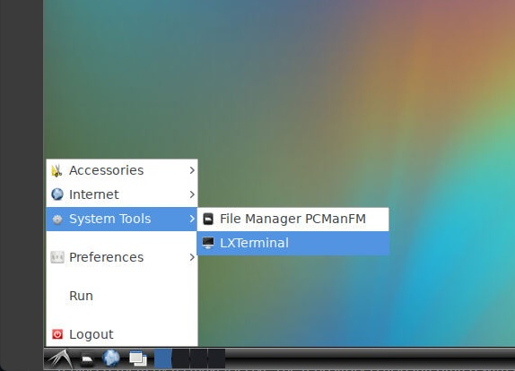
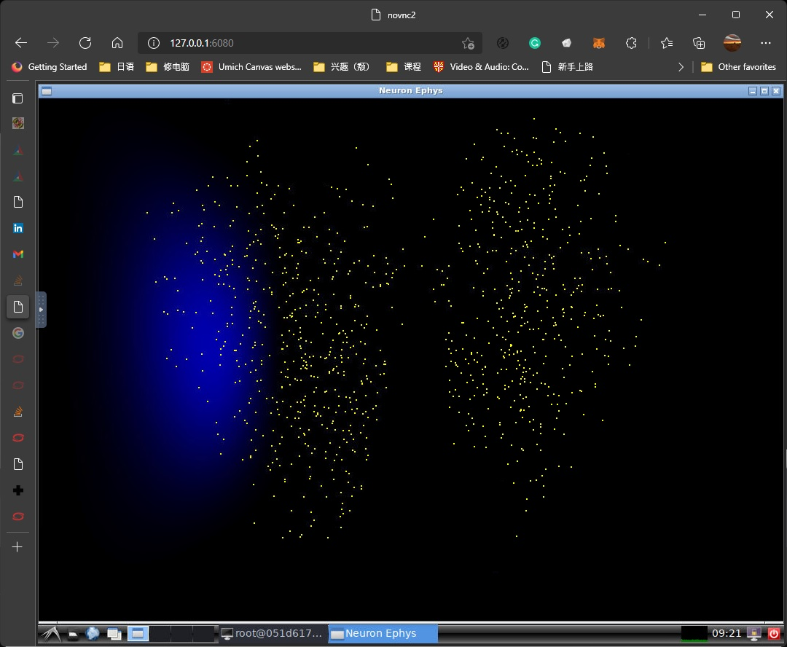

# neuronephys_clean
A cleaned version of neuroephys_v2 that removed the binary dependencies and replaced them by a cmakelists.txt.
The repository is also integrated with Dockerfile that enables ```single-line configuration.```

This repository uses ```git LFS``` to handle the large binary files. Install it before cloning the repository. 
## Installation guide
The suggested installation method is to build using docker. To install docker on your computer, refer to [get docker](https://docs.docker.com/get-docker/). 
Additionally, a supported NVIDIA GPU, a sufficiently recent driver (```>= v440.82``` for Linux, ```>= v471.41``` for Windows has been verified to work.)

For Linux-based machines, [NVIDIA container toolkit](https://docs.nvidia.com/datacenter/cloud-native/container-toolkit/install-guide.html) is needed.

For Windows-based machines, WSL2 backend for docker is used. Either Windows 10 Insider preview version or Windows 11 is needed. Refer to [this page](https://docs.nvidia.com/cuda/wsl-user-guide/index.html) and [this page](https://docs.microsoft.com/ja-jp/windows/ai/directml/gpu-cuda-in-wsl) about the setup for CUDA on WSL2. 

When docker is correctly installed, the image can be built by

```docker build -t <tag_name> .```
in the root directory. (Replace ```<tag_name>``` with a name of the image of your choice without the brackets. The process is slow (more than 30 minutes), as Arrayfire is huge, and is built from source.)

To build the whole-brain simulation version, build by specifying the alternate Dockerfile:

```docker build -f Dockerfile.wholebrain -t <tag_name> .```

## Run guide
With the configuration complete, run

```docker run -v /shm/dev:/dhm/dev -p 6080:80 --gpus all -m 8192m <tag_name>```

Note: ```-m 8192m``` allows the container to use up to 8G of memory, and is verified to be sufficient for the example. It may be possible to tighten this bound.
For the whole-brain simulation, allocate at least 16G of memory.

Then visit ```127.0.0.1:6080``` using a modern web browser.

Open LXTerminal:



Run ```cd /src/neuronephys```, then ```./neuronephys```:



If everything goes smoothly, a program similar to above should show up.

## Alternative setup on local computer
The program can be built with ```CMake```. While ```Dockerfile``` contains the details, here is an overview of the caveats: 
<ol>
  <li> ANN_ROOT and GLM_ROOT need to be passed as an argument to CMake, as ```findANN``` and ```findGLM``` are some very ad-hoc findpackage files that are only tested to work here. </li>
  <li> build ANN using what is included here! There are slight modifications from the most common version online, notebly using float instead of double. </li>
  <li> On Windows machines, use CMake to generate a Visual Studio project. Then, replace ```GL.lib``` with ```OpenGL32.lib``` in ```Linker->Input->Additional Dependencies```, and copy all the dll files with corresponding name to the directory containing the generated project file. </li>
  <li> You take the responsibility for the compatibility! The docker uses CUDA 11.1. It also works with CUDA 11.4.</li>
</ol>
  
